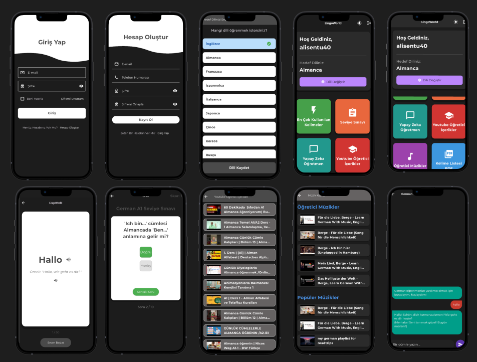

# Lingo World 🌍

LingoWorld, öğrencilerin dil öğrenme süreçlerini kolaylaştırmak amacıyla geliştirilmiş bir mobil uygulamadır. BTK Hackathon Yarışması için hazırlanan bu uygulama, kullanıcının İngilizce, Almanca, Fransızca, İspanyolca, İtalyanca, Japonca, Çince, Korece ve Rusça gibi en bilinen dilleri öğrenmesini hedeflemektedir.

Uygulamadaki en çok kullanılan kelimeler, kelime sınavı, seviye sınavı, yapay zekâ öğretmen, YouTube öğretici içerikler, öğretici müzikler, kelime listesi PDF gibi materyaller hedef dili öğrenme süresini en aza indirip öğrenme sürecini daha eğlenceli hale getirmeyi amaçlamaktadır.

Uygulama; özellikle dil bilmenin çok önemli olduğu bu zamanlarda dil öğrenmeye istekli herkesin öğrenmesini kolaylaştırmak, süreci daha eğlenceli ve etkileşimli hale getirmek amacıyla tasarlanmıştır. Geleneksel ezberleme yöntemlerinin aksine, LingoWorld; yapay zekâ destekli interaktif kelime kartları ve çoktan seçmeli testler sunarak kullanıcıların kelime dağarcığını kalıcı bir şekilde geliştirmesine yardımcı olur. Bu sayede, dili bir ders olarak değil, günlük yaşamın bir parçası olarak deneyimleyebilir ve öğrenme motivasyonunu sürekli yüksek tutabilirsiniz. LingoWorld, her seviyeden öğrencinin kendi hızında ilerleyebileceği, kişiselleştirilmiş bir öğrenme deneyimi sunarak dil becerilerini en verimli şekilde geliştirmesini sağlar.

## 📱 Uygulama Figma Tasarımları

## 📸 Uygulama Tanıtım Videosu 
[GOGLE DRİVE VİDEO](https://drive.google.com/file/d/1l3KuHPCguj8fu_iSgR-MXteyL1cOGqKH/view?usp=sharing)

## 🛠️ Kullanılan Teknolojiler

| Kategori | Teknoloji | Açıklama |
| :--- | :--- | :--- |
| **Geliştirme Ortamı** | `Flutter` | Mobil uygulama arayüzü ve iş mantığı. |
| **UI/UX Tasarım** | `Figma` | Uygulama arayüzlerinin görsel tasarımı ve prototiplenmesi. |
| **Yapay Zekâ** | `Google Gemini API` | Seçilen dile göre dinamik kelime listeleri ve örnek cümleler oluşturur. |
| **Yerel Depolama** | `Hive` | Kelime listelerini ve kullanıcı ayarlarını cihazda hızlı ve güvenli bir şekilde saklar. |
| **Metin Okuma (TTS)** | `flutter_tts` | Kelime ve örnek cümlelerin sesli olarak okunmasını sağlar. |
| **UI/UX Bileşenleri** | `Google Fonts`, `Card`, `PageView` | Modern ve kullanıcı dostu bir arayüz oluşturmak için kullanılan Flutter widget'ları ve kütüphaneleri. |

## ✨ Uygulama Özellikleri

Uygulama, hedef dili öğrenme süresini en aza indirirken, öğrenme sürecini daha eğlenceli ve etkileşimli hale getirmeyi amaçlayan zengin özellikler sunar.

*Kelime Sınavı*: Öğrendiğiniz kelimeleri pekiştirmek için tasarlanmış, pratik ve hızlı kelime testleri ile bilginizi anında ölçün.

-Seviye Sınavı: Dil öğrenme yolculuğunuza nereden başlayacağınızı belirlemek veya mevcut seviyenizi görmek için tasarlanmış sınavlarla kendinizi değerlendirin.

-Yapay Zekâ Öğretmen: Google Gemini destekli yapay zekâ öğretmeninizden, dil bilgisi kuralları, kelime kullanımları ve cümle yapıları hakkında anlık destek ve açıklayıcı bilgiler alın.

-YouTube Öğretici İçerikler: Seçtiğiniz dile özel olarak hazırlanmış, YouTube'daki en popüler ve faydalı video içeriklerine doğrudan erişim sağlayın.

-Öğretici Müzikler: Müziğin gücünü kullanarak dil öğrenin. Öğretici ve akılda kalıcı şarkılarla yeni kelimeleri ve telaffuzları daha kolay benimseyin.

-Kelime Listesi PDF: Uygulamada öğrendiğiniz kelime listelerini PDF formatında dışa aktararak, internet bağlantısı olmadan veya basılı materyal olarak çalışmaya devam edin.

